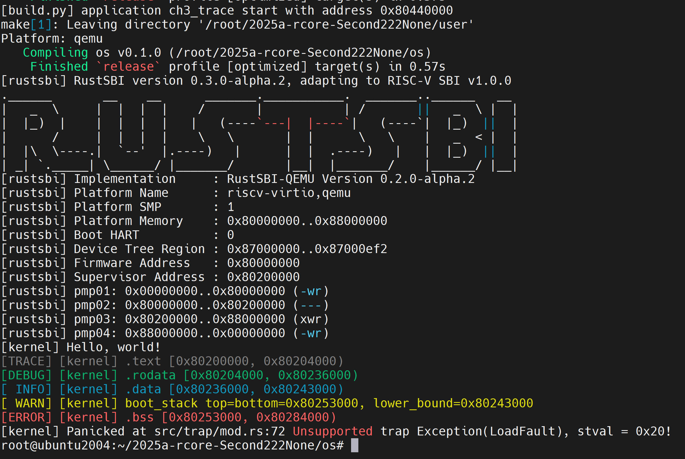

# [lab1](https://learningos.cn/rCore-Tutorial-Guide-2025S/chapter3/5exercise.html)

编程作业

实现了两个版本：
- 第一个版本是将系统调用的统计信息保存在TaskManagerInner中，缺点是数据有冗余，该版本遇到了一个问题，通过查看内存布局发现TaskManagerInner位于最后的bss段，未发现内存覆盖的可能
- 第二个版本将系统调用统计信息放在TaskControlBlock中

TaskManagerInner中的添加了个变量syscall_times，syscall_times和current_task两个字段按图中位置运行正确，交换顺序会报错[kernel] Panicked at src/trap/mod.rs:72 Unsupported trap Exception(LoadFault), stval = 0x20!



```c
/// Inner of Task Manager
pub struct TaskManagerInner {
    /// task list
    tasks: [TaskControlBlock; MAX_APP_NUM],
    /// id of current `Running` task
    current_task: usize,
    /// syscall times
    syscall_times: [[usize; 512]; MAX_APP_NUM],
}
```


简答作业

1. 正确进入 U 态后，程序的特征还应有：使用 S 态特权指令，访问 S 态寄存器后会报错。 请同学们可以自行测试这些内容（运行 三个 bad 测例 (ch2b_bad_*.rs) ）， 描述程序出错行为，同时注意注明你使用的 sbi 及其版本。

    执行`make run`后，三个bad测试用例会触发异常，最终有`trap_handler()`处理，具体提示如下。其中sbi的版本是`RustSBI version 0.3.0-alpha.2`。

    ```
    [kernel] PageFault in application, bad addr = 0x0, bad instruction = 0x804003a4, kernel killed it.
    [kernel] IllegalInstruction in application, kernel killed it.
    [kernel] IllegalInstruction in application, kernel killed it.
    ```

2. 深入理解 trap.S 中两个函数 __alltraps 和 __restore 的作用，并回答如下问题:
    
- L40：刚进入 __restore 时，sp 代表了什么值。请指出 __restore 的两种使用情景。

    刚进入`__restore`的时候，sp代表的是内核栈的栈顶（低地址）。`__restore`的两种使用场景是系统调用返回U的时候和构造完堆栈后任务初次启动时。

- L43-L48：这几行汇编代码特殊处理了哪些寄存器？这些寄存器的的值对于进入用户态有何意义？请分别解释。
    ```
    ld t0, 32*8(sp)
    ld t1, 33*8(sp)
    ld t2, 2*8(sp)
    csrw sstatus, t0
    csrw sepc, t1
    csrw sscratch, t2
    ```

    CPU处理完Trap准备返回的时候，需要被告知返回到哪个特权级、哪一条执行等重要信息。sepc保存的是目标指令地址，sstatus保存了目标特权级的信息。sscratch指向用户态堆栈，在sret之前由操作系统负责切换。

- L50-L56：为何跳过了 x2 和 x4？
    ```
    ld x1, 1*8(sp)
    ld x3, 3*8(sp)
    .set n, 5
    .rept 27
    LOAD_GP %n
    .set n, n+1
    .endr
    ```

    x2的位置用于保存用户态堆栈地址，x4应用没有使用到这个寄存器

- L60：该指令之后，sp 和 sscratch 中的值分别有什么意义？
    ```
    csrrw sp, sscratch, sp
    ```
    sp指向用户态堆栈，sscratch指向内核堆栈

- __restore：中发生状态切换在哪一条指令？为何该指令执行之后会进入用户态？

    状态切换发生在sret指令。该指令完成以下功能：
    - CPU 会将当前的特权级按照 sstatus 的 SPP 字段设置为 U 或者 S ；
    - CPU 会跳转到 sepc 寄存器指向的那条指令，然后继续执行。

- L13：该指令之后，sp 和 sscratch 中的值分别有什么意义？
    ```
    csrrw sp, sscratch, sp
    ```
    sp指向内核堆栈，sscratch指向用户态堆栈

- 从 U 态进入 S 态是哪一条指令发生的？
    
    ecall


# 荣誉准则

1. 在完成本次实验的过程（含此前学习的过程）中，我曾分别与 以下各位 就（与本次实验相关的）以下方面做过交流，还在代码中对应的位置以注释形式记录了具体的交流对象及内容：
    无

2. 此外，我也参考了 以下资料 ，还在代码中对应的位置以注释形式记录了具体的参考来源及内容：
    无

3. 我独立完成了本次实验除以上方面之外的所有工作，包括代码与文档。 我清楚地知道，从以上方面获得的信息在一定程度上降低了实验难度，可能会影响起评分。

4. 我从未使用过他人的代码，不管是原封不动地复制，还是经过了某些等价转换。 我未曾也不会向他人（含此后各届同学）复制或公开我的实验代码，我有义务妥善保管好它们。 我提交至本实验的评测系统的代码，均无意于破坏或妨碍任何计算机系统的正常运转。 我清楚地知道，以上情况均为本课程纪律所禁止，若违反，对应的实验成绩将按“-100”分计。
